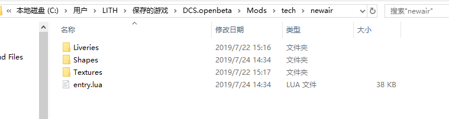

# 目录结构

修改DCS系统自身的文件会导致红盾，且被修改后文件的哈希值会发生变化，在进行更新时DCS_Updater会将修改还原，所以不要修改DCS\目录中的文件。官方推荐在`X:\Users\<username>\Saved Games\DCS\Mod\`中添加第三方的MOD。

进入 `X:\Users\<username>\Saved Games\DCS\` 目录，新建`Mods\tech\newair`目录。

新建`entry.lua`。



## API

entry.lua`会在DCS启动前被回调，可以在entry.lua中引用其他的lua文件。在entry.lua中可使用的API与Hooks不同，相比Hooks会更少。具体可调用的成员和方法在DCS\Scripts\Database\db_mods.lua中的make_environment方法中的env中定义。

```lua
local env = {
    table                  = table, 
    pairs                  = pairs,
    ipairs                 = ipairs,
    type                   = type,
    assert                 = assert_,
    print                  = print_,
    math                   = math,
    tostring               = tostring,
    _ = _,
    --some global defines
    __DCS_VERSION__		   =  __DCS_VERSION__,
    __FINAL_VERSION__	   =  __FINAL_VERSION__,
    ED_FINAL_VERSION		= __FINAL_VERSION__,
    ED_PUBLIC_AVAILABLE		= ED_PUBLIC_AVAILABLE,
    USE_TERRAIN4			= true,

    mount_vfs_model_path	= mount_vfs_model_path,
    mount_vfs_texture_path	= mount_vfs_texture_path,
    mount_vfs_liveries_path	= mount_vfs_liveries_path,
    mount_vfs_sound_path	= mount_vfs_sound_path,
    declare_plugin			= declare_plugin,
    plugin_done				= plugin_done,
    WSTYPE_PLACEHOLDER		= WSTYPE_PLACEHOLDER,
    --weapon loadout declaration
    CAT_BOMBS 	 			= CAT_BOMBS,
    CAT_MISSILES   			= CAT_MISSILES,
    CAT_ROCKETS	 			= CAT_ROCKETS, --!unguided!
    CAT_AIR_TO_AIR 			= CAT_AIR_TO_AIR,
    CAT_FUEL_TANKS 			= CAT_FUEL_TANKS,
    CAT_PODS	 	 		= CAT_PODS,
    CAT_SHELLS				= CAT_SHELLS,
    CAT_GUN_MOUNT	 		= CAT_GUN_MOUNT,
    CAT_CLUSTER_DESC		= CAT_CLUSTER_DESC,
    declare_weapon			= declare_weapon,
    declare_loadout			= declare_loadout,	
    cluster_desc			= cluster_desc,		
    combine_cluster			= combine_cluster,
    --warheads 
    simple_aa_warhead			=	simple_aa_warhead,							
    enhanced_a2a_warhead        =   enhanced_a2a_warhead,
    directional_a2a_warhead     =   directional_a2a_warhead,
    simple_warhead              =   simple_warhead,
    cumulative_warhead          =   cumulative_warhead,
    penetrating_warhead         =   penetrating_warhead,
    antiship_penetrating_warhead=   antiship_penetrating_warhead,
    predefined_warhead 			=   predefined_warhead,

    get_bomb_munition		= function(nm) return weapons_table.weapons.bombs[nm] end,
    PTAB_2_5_DATA			= PTAB_2_5_DATA,
    PTAB_10_5_DATA 			= PTAB_10_5_DATA,
    AO_2_5_DATA				= AO_2_5_DATA,
    MK118_DATA				= MK118_DATA,
    BLU97B_DATA				= BLU97B_DATA,
    BLU108B_DATA			= BLU108B_DATA,
    HEAT_DATA				= HEAT_DATA,

    add_aircraft           = add_aircraft,
    pylon                  = pylon,
    aircraft_task          = aircraft_task,
    gun_mount              = gun_mount,
    smoke_effect 		   = smoke_effect,
    fire_effect 		   = fire_effect,
    declare_gun_mount	   = declare_gun_mount,
    --tasks
    Nothing                 = Nothing,          
    SEAD                    = SEAD,            
    AntishipStrike          = AntishipStrike,  
    AWACS                   = AWACS,           
    CAS                     = CAS,             
    CAP                     = CAP ,            
    Escort                  = Escort,          
    FighterSweep            = FighterSweep ,   
    GroundAttack            = GroundAttack ,   
    Intercept               = Intercept   ,    
    AFAC                    = AFAC        ,    
    PinpointStrike          = PinpointStrike,   
    Reconnaissance          = Reconnaissance , 
    Refueling               = Refueling      , 
    RunwayAttack            = RunwayAttack   , 
    Transport               = Transport     ,
    MODULATION_AM			= MODULATION_AM,
    MODULATION_FM			= MODULATION_FM,
    LOOK_BAD				= LOOK_BAD,
    LOOK_AVERAGE			= LOOK_AVERAGE,
    LOOK_GOOD				= LOOK_GOOD,
    LOOK_EXELLENT_B17 		= LOOK_EXELLENT_B17,
    add_unit_to_country		= add_unit_to_country,
    makeAirplaneCanopyGeometry = makeAirplaneCanopyGeometry,
    makeHelicopterCanopyGeometry = makeHelicopterCanopyGeometry,
    verbose_to_dmg_properties = verbose_to_dmg_properties, --damage
    set_manual_path		   	  = function(unit,manual_path)  		   various_unit_settings(unit,{ManualPath = manual_path}) end,
    make_view_settings		  = function(unit,ViewSettings,SnapViews)  various_unit_settings(unit,{ViewSettings = ViewSettings,SnapViews    = SnapViews}) end,
    --ground units adding support------------------------------
    set_recursive_metatable = set_recursive_metatable,
    new_reference			= new_reference,
    add_launcher            = add_launcher,
    add_surface_unit        = add_surface_unit,
    GT_t                    = db.Units.GT_t,
    ------------------------------------------------------------	
    -- sensors declaration
    SENSOR_OPTICAL      = SENSOR_OPTICAL,
    SENSOR_RADAR        = SENSOR_RADAR,
    SENSOR_IRST         = SENSOR_IRST,
    SENSOR_RWR          = SENSOR_RWR,
    --RADAR
    RADAR_AS            = RADAR_AS,
    RADAR_SS            = RADAR_SS,
    RADAR_MULTIROLE     = RADAR_MULTIROLE,
    --
    ASPECT_HEAD_ON      = ASPECT_HEAD_ON,
    ASPECT_TAIL_ON      = ASPECT_TAIL_ON,
    --
    HEMISPHERE_UPPER    = HEMISPHERE_UPPER,
    HEMISPHERE_LOWER    = HEMISPHERE_LOWER,
    --IRST
    ENGINE_MODE_FORSAGE = ENGINE_MODE_FORSAGE,
    ENGINE_MODE_MAXIMAL = ENGINE_MODE_MAXIMAL,
    ENGINE_MODE_MINIMAL = ENGINE_MODE_MINIMAL,
    --OPTIC
    OPTIC_SENSOR_TV     = OPTIC_SENSOR_TV,
    OPTIC_SENSOR_LLTV   = OPTIC_SENSOR_LLTV,
    OPTIC_SENSOR_IR     = OPTIC_SENSOR_IR,

    FIXED_WING					= FIXED_WING,				
    VARIABLE_GEOMETRY			= VARIABLE_GEOMETRY,
    FOLDED_WING					= FOLDED_WING,				
    VARIABLE_GEOMETRY_FOLDED 	= VARIABLE_GEOMETRY_FOLDED, 

    declare_sensor		= declare_sensor,
    make_default_mech_animation = make_default_mech_animation,
    ------------------------------------------------------------	
}
```
