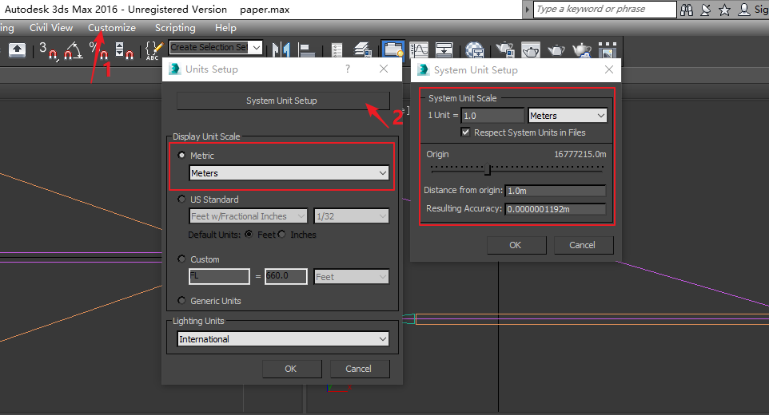
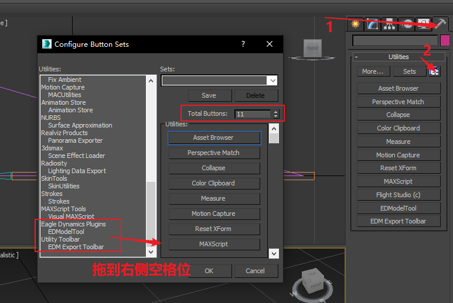
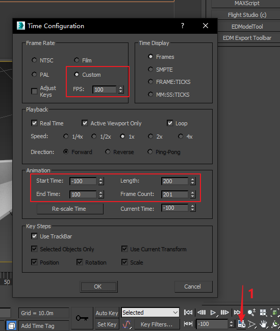
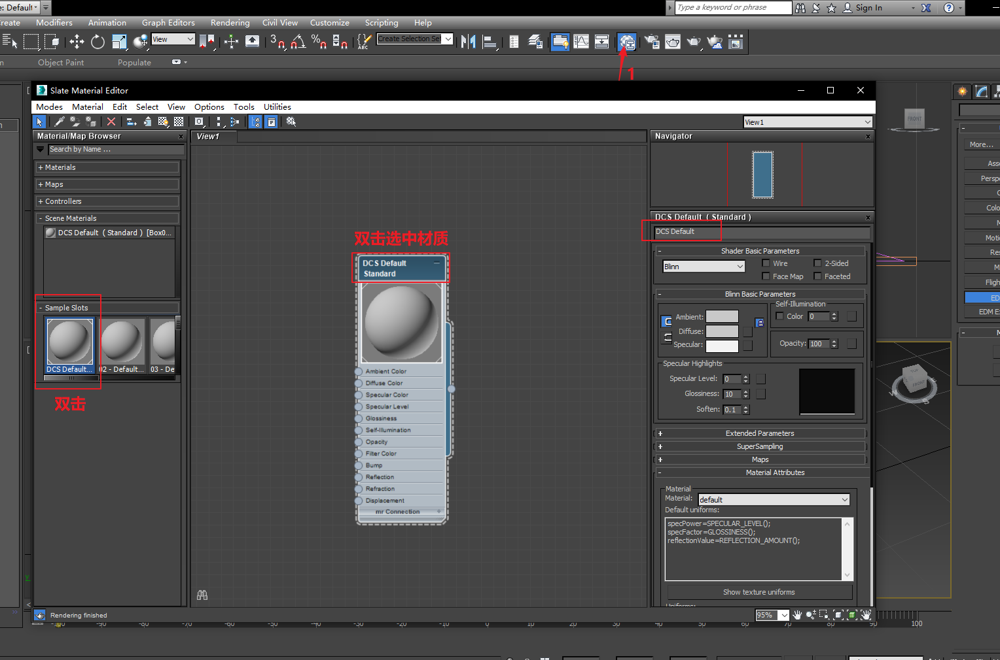
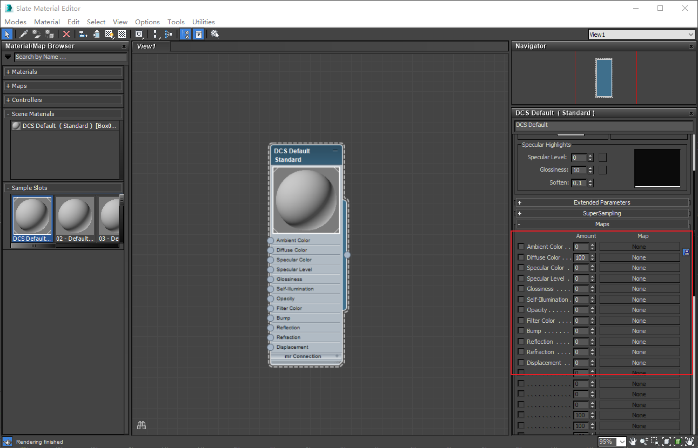
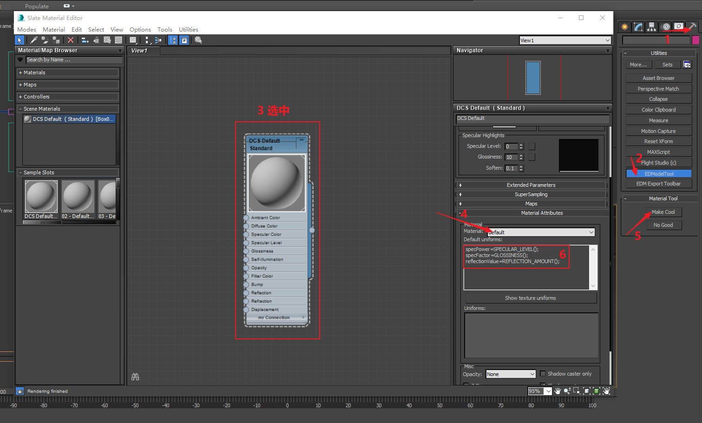
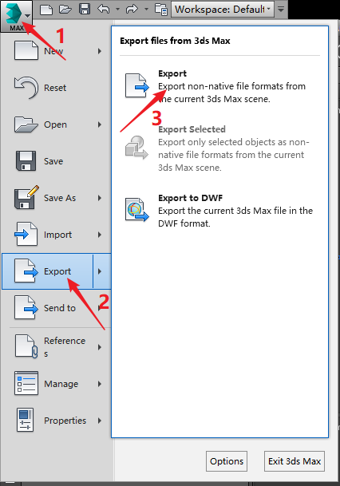

# 3D MAX 基础说明

## 安装 3D MAX

使用的是3D MAX 2016

## 安装edm-plugins
edm-plugins是3D Max的插件，这个东西更新非常频繁，去`ftp://srv0files.eagle.ru/mods/edm_plugins/`下载edm-plugins插件并安装。
参考文献[Newest EDM Model Tools](https://forums.eagle.ru/showthread.php?t=86205)

## 3D Max 设置

#### 设置单位

#### 启用EDModelTool和EDM Export Toolbar

#### 设置动画速度

StartTime、EndTime与文献文档所不同，StartTime设为-100，End Time设为100

* -100帧对应Args的（-1.0）
* 0帧对应Args的（0.0）

* 100帧对应Args的（1.0）

#### 设置DCS Default材质

#### 调整DCS Default材质的Maps属性

#### 使用EDModelTool处理材质

处理完成后，Material Attributes中会生成代码，在导出edm文件时，只有DCS Default（被MakeCool的）这个材质会被导出。

#### 导出edm文件

从export中选择edm文件 

