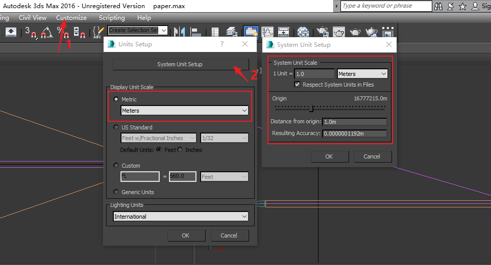
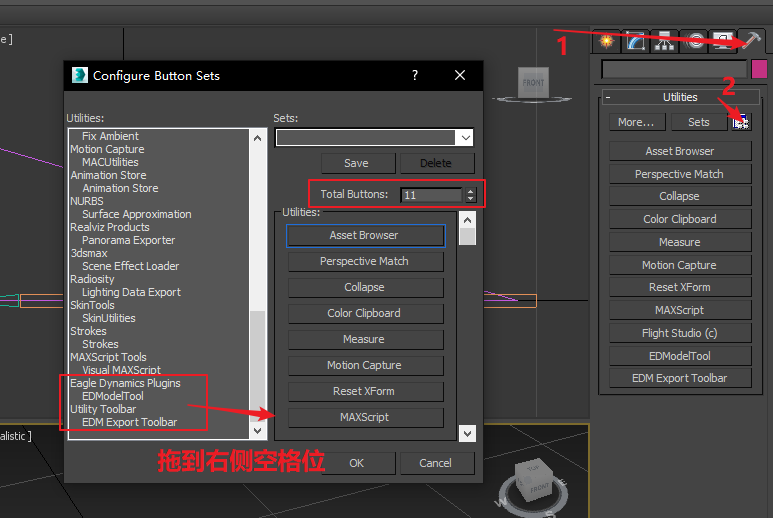
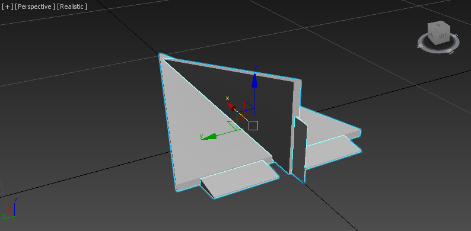
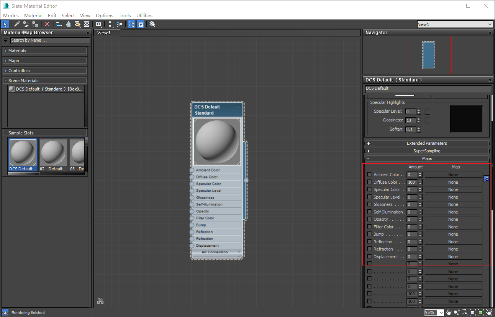

# 3D MAX 基础

## 安装 3D MAX

使用的是3D MAX 2016

## 安装edm-plugins
edm-plugins是3D Max的插件,用来设置动画和导出edm文件，这个东西更新非常频繁，下载地址

> ftp://srv0files.eagle.ru/mods/edm_plugins/

参考文献[Newest EDM Model Tools](https://forums.eagle.ru/showthread.php?t=86205)

## 设置单位

使用米作为单位

## 启用EDModelTool和EDM Export Toolbar

把EDModelTool和EDM Export Toolbar设置到工具面板里

## 设置动画速度

StartTime、EndTime的设置与文献文档不同，这里StartTime设为-100，End Time设为100。

* -100帧对应Args的（-1.0）
* 0帧对应Args的（0.0）

* 100帧对应Args的（1.0）

## 坐标系

`nose_gear_pos = { 3.3, -2, 0}`，{X,Y,Z}是lua中常用的坐标表示法。

* X = 机头方向，头为正，尾为负

* Y = 高，机背为正，机腹为负

* Z = 左右，右为正，左为负

以DCS lua中表示法为准，lua与3D MAX坐标系的对应关系为：

* X = X轴

* Y = Z轴

* Z = Y轴

参数`{3.3,-2,0}`，应从3D MAX中依次在X轴，Z轴，Y轴上获取。

## 设置DCS Default材质

调整DCS Default材质的Maps属性

使用EDModelTool处理材质，处理完成后，会在Material Attributes(6)中会生成代码，在导出edm文件时，只有使用DCS Default（被MakeCool的）这个材质的图形会被导出。

> MEDModelTool 的MakeCool在中文3D MAX下会报错，英文下正常。

## 导出edm文件

从export中选择edm文件 

