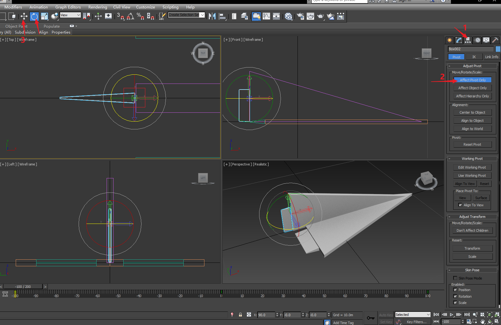
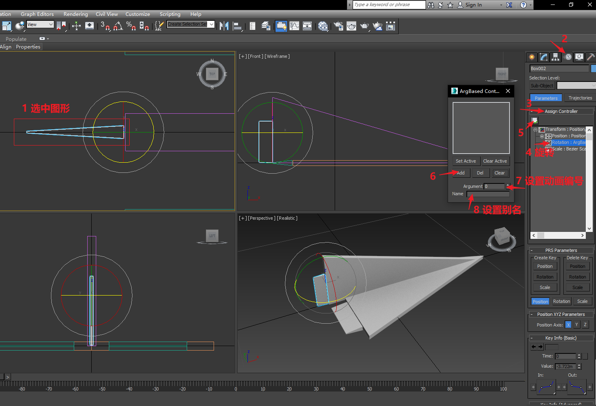
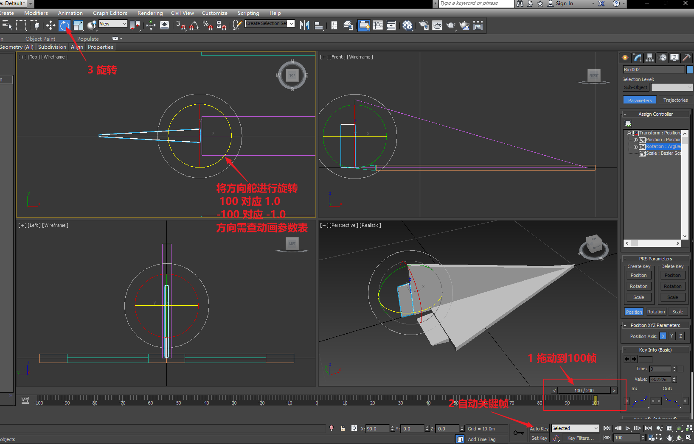
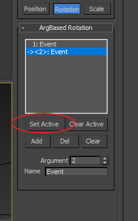
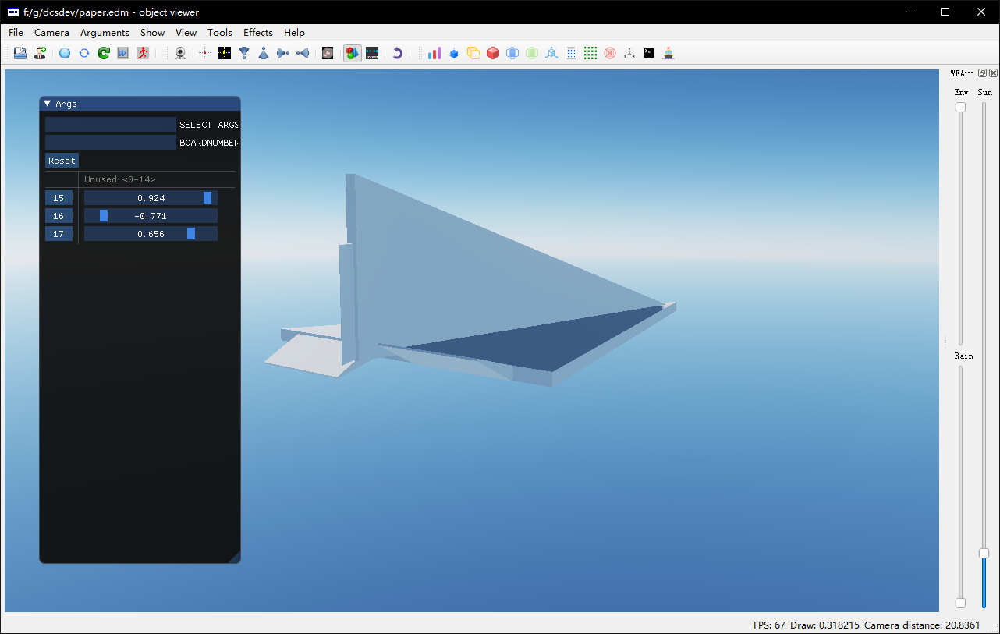

# L3 EDM动画

[3D MAX 实例文件](attachment\L3paper.max)

[EDM实例文件](attachment\L3paper.edm)

## 设置旋转原点

设置方向舵旋转轴的位置，方便制作动画

* 选中图形
* 选择Hierarchy标签
* 点击Affect Pivot Only
* 移动调节手柄到合适的位置

## 设置动画

创建可被DCS和ModelViewer识别的动画

* 选中图形
* 进入Motion面板，展开Assign Controller
* 选中Rotation
* 点击Assign Controller按钮
* 从列表中选择ArgBased Rotation
* 点击Add创建一个Arg动画
* 输入Argument编号和Name

DCS 对一些Argument编号有固定的定义，参见“动画ID表”。

* 选中图形，使用自动关键帧功能
* 拖动到第100帧，旋转图形
* 拖动到第-100帧，反向旋转图形
* 这样就做好了一个旋转动画

## 管理多个动画

在多个物体中上可以设置同一个或多个动画ID，可以实现由一个参数控制多个物体的动画。

点击Set Active可以在3D MAX中激活、预览某一个Arg动画。

## 使用ModelViewer查看edm模型

启动ModelViewer（`DCS\bin\ModelViewer2.exe`），打开edm文件。可以在左侧看到动画参数，拖动滑块可以预览动画。

## 动画ID表

1. [Draw arguments for aircrafts 1.1](attachment\Draw arguments for aircrafts 1.1.rtf)
1. [Draw arguments for vehicles 1.2](attachment\Draw arguments for vehicles 1.2.rtf)
1. [Draw arguments for ships 0.1](attachment\Draw arguments for ships 0.1.doc)
1. [Draw arguments for weapons 1.1](attachment\Draw arguments for weapons 1.1.rtf)